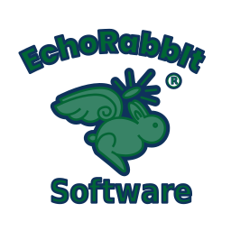

# EchoRabbit 小红书卡片生成器

<p align="center">
  
</p>

<p align="center">
  <strong>一款专为小红书创作者设计的精美卡片生成工具</strong>
</p>

<p align="center">
  <a href="#功能特性">功能特性</a> •
  <a href="#快速开始">快速开始</a> •
  <a href="#使用指南">使用指南</a> •
  <a href="#在线演示">在线演示</a>
</p>

---

## ✨ 功能特性

- 🎨 **精美模板** - 预设 EchoRabbit 品牌风格和语录类模板，一键应用
- 🖼️ **多卡片编辑** - 支持创建多张卡片，类似 PPT 的分页编辑体验
- 🔧 **可视化编辑** - 拖拽调整元素位置，支持等比例缩放
- 📝 **丰富元素** - 文字、图片、贴纸自由组合
- 🎨 **背景系统** - 纯色、渐变、图片背景，支持 Cover/Contain 适配模式
- 🔤 **字体系统** - 内置 Poppins、思源黑体、思源宋体等字体，支持自定义字体导入
- 📦 **批量导出** - 一键导出所有卡片为 ZIP 压缩包
- 💾 **模板保存** - 支持保存自定义模板到本地

## 🚀 快速开始

### 方式一：在线使用（推荐）

直接访问 GitHub Pages 部署的在线版本：

👉 **[点击使用在线版](https://你的用户名.github.io/RedBookV1/)**

### 方式二：本地使用

1. 克隆仓库
```bash
git clone https://github.com/你的用户名/RedBookV1.git
```

2. 进入项目目录
```bash
cd RedBookV1
```

3. 用浏览器打开 `index.html` 即可使用

> 💡 提示：由于使用了一些现代浏览器 API（如 FontFace API），建议使用 Chrome、Firefox、Edge 等现代浏览器。

## 📖 使用指南

### 创建卡片

1. **选择模板** - 从左侧预设模板中选择一个风格
2. **编辑内容** - 点击画布上的元素进行编辑
3. **添加元素** - 使用顶部工具栏添加文字、图片、贴纸
4. **调整样式** - 在右侧属性面板调整字体、颜色、位置等
5. **添加卡片** - 点击底部"+ 添加卡片"创建多张卡片

### 导出卡片

1. 点击顶部"导出 ZIP"按钮
2. 等待导出进度完成
3. 自动下载包含所有卡片的 ZIP 文件
4. 每张卡片为 1080×1440 像素的 PNG 图片

## 🛠️ 技术栈

- **HTML5** - 语义化结构
- **CSS3** - CSS Variables 主题系统、Grid/Flex 布局
- **原生 JavaScript (ES6+)** - 无框架依赖
- **html-to-image** - 高质量图片导出
- **JSZip** - ZIP 文件打包
- **FileSaver.js** - 文件下载

## 📁 项目结构

```
RedBookV1/
├── index.html          # 主入口文件
├── css/
│   └── style.css       # 样式文件
├── js/
│   └── app.v2.js       # 应用主逻辑
├── fonts/              # 字体文件
│   └── poppins/
├── assets/             # 静态资源
│   ├── logo.svg
│   ├── 背景.png
│   ├── 素材贴图_*.png
│   └── favicon.ico
├── docs/
│   └── design.md       # 设计文档
└── README.md           # 本文件
```

## 🌟 特色功能

### 智能图片处理
上传图片时会自动按原始分辨率等比缩放，确保图片完整显示在卡片内，不会变形或裁剪。

### 动态字体系统
- 选择 Poppins 字体时，可使用 9 级字重（100-900）
- 选择其他字体时，自动切换为 4 级字重
- 支持导入 TTF/OTF/WOFF/WOFF2 格式自定义字体

### 画布自适应
- 页面加载时自动计算最佳缩放比例
- 支持 10%-200% 手动缩放
- 双击空白处一键自适应

## 📝 浏览器兼容性

| 浏览器 | 最低版本 |
|--------|----------|
| Chrome | 90+ |
| Firefox | 88+ |
| Safari | 14+ |
| Edge | 90+ |

## 🤝 贡献

欢迎提交 Issue 和 Pull Request！

## 📄 许可证

MIT License © 2024 EchoRabbit Software

---

<p align="center">
  Made with ❤️ by <a href="https://github.com/你的用户名">EchoRabbit</a>
</p>
